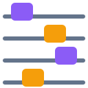

<div align="center">

<h1> ContextManager</h1>

**Catches what's bogging down your Claude Code session and lets you fix it in one click.**

[](https://claude.com/claude-code) [](scripts/check.sh) [](#development) [](LICENSE)

</div>

Sessions bog down when Claude repeats a pattern it didn't need to. Running the full test suite after
every one-line edit. Reading the same file for the fourth time. Dumping a 2,000-line log into context
to find one traceback. Each of these had a shorter path to the same result — that gap is the waste.
ContextManager spots those patterns as they compound and surfaces them while you can still act.

## Features

- **It names the pattern, not the big output.** "Claude keeps running the whole suite after every
  one-file edit — 3×, ~9% of context, 3m 12s." The calls behind the claim are one keypress away.
- **Nothing to configure.** No thresholds, no rules to tune. The plugin gathers the evidence and the
  model asks: was there a shorter path to the same result? That catches things nobody wrote a rule for.
- **It works mid-turn.** Long agentic turns are checked while they run, and your fix reaches Claude on
  its next tool result, then rides every prompt after it, so it survives compaction.
- **It shows where your session went.** One line each for time and context, and a plain sentence on what
  those minutes and tokens actually bought.
- **It stays quiet.** A single occurrence is never a finding. A wrong card costs more than a missed one.
- **Fixes outlive the session.** Turn a decision into a CLAUDE.md rule, a skill, an agent brief or a
  permission rule, written only when you click `Write`.
- **It reads in your language.** English, French, Spanish, German, Simplified Chinese and Japanese, picked
  from `/config` — the pane, the band, the replies, and the cards the audit writes, findings included.
- **It never touches your work unless you say so.** No tool denied, no output trimmed, no error hidden. With
  the `apply` row of `/config` off — the default — no call is changed either. Turned on, only the commands of
  cards you pressed Apply on are rewritten, each rewrite is announced to Claude, and running the original
  again lets it through. If a hook throws, your session carries on as if the plugin weren't there.
- **Rules stay honest.** `Write` shows what it would write before it writes it and refuses a rule the file
  already has; a rule whose behaviour never came back, and was a one-off before, is offered for removal.

## Install

> [!NOTE]
> Needs Claude Code 2.1.280 or newer. ContextManager is a
> [Claude Mod](https://github.com/anthropics/claude-code/tree/main/mods), built on function hooks, which
> are early access — so enable the flag first.

```sh
export CLAUDE_CODE_ENABLE_FUNCTION_HOOKS=1   # your shell, or ~/.claude/settings.json under "env"
```

Then, in Claude Code:

```
/plugin marketplace add devohmycode/claude-mods
/plugin install contextmanager@claude-devohmycode-mods
```

That is the whole setup: no config, no API key, no dependencies, no build step. Installing mid-session
works too — the plugin reads what already happened out of the transcript and checks it right away, without
waiting for your next prompt.

## Usage

1. **Work as usual.** One line sits above your prompt and stays quiet until something repeats.
2. **A card appears** in the pane beside your transcript: what Claude keeps doing, how often, what it has
   cost you in context and minutes, and what to do instead. Press `i` for the calls behind it.
3. **Choose.** `Fix` sends the suggested fix, `Fix…` lets you reword it first, `Ignore` drops it for the
   session.
4. **Claude changes course** in the turn already running, and the pane credits what you saved — or tells
   you the instruction was ignored.
5. **Keep what worked.** Each decision is offered as a CLAUDE.md rule, a skill, an agent brief or a
   permission rule: `Write` saves it, `Try` uses it for this session only, `Skip` drops it.

> [!TIP]
> The pane docks beside your transcript in a wide terminal and sits above the prompt otherwise. `/manager`
> toggles it at any width, `ctrl+x tab` moves the keyboard into it, `Tab` cycles the buttons, `Enter`
> presses, and `Esc` hands the keys back.

### Commands

| Command | What it does |
|---|---|
| `/manager` | Show or hide the pane. |
| `/manager check` | Check now, instead of waiting for the next automatic check. |
| `/manager fix <n>` | Send card `n`'s suggested fix. |
| `/manager fix [n] <text>` | Send your own instruction instead. Without a number: the open card, else card 1. |
| `/manager ignore <n>` | Drop card `n` for the rest of the session. |
| `/manager apply <n>` | Fix card `n` and rewrite its calls from now on (needs the `apply` row of `/config`). |
| `/manager report` | Write this session's report to `.claude/contextmanager/report-<date>.md`. |
| `/manager stats` | What this project's sessions found, fixed, ignored and saved, and what the audit cost. |
| `/manager unmute <id>` | Hear again a behaviour this project muted (ignored in three sessions). |
| `/manager debug` | Print the session state: ledger, findings, decisions, what the audit cost, savings. |
| `/manager reset` | Clear this session's ledger and decisions. Learned patterns survive. |

### Settings

Two more rows of `/config` → **ContextManager**, besides the language:

| Row | What it does |
|---|---|
| **Sensitivity** | `quiet` waits for twice the work between audits, needs one more occurrence before the code names a behaviour and keeps at most three findings per audit; `verbose` checks twice as often and names a behaviour one occurrence sooner. `normal` is the default. |
| **Apply** | Off by default. On, a card whose behaviour has a rewrite offers `Apply` beside `Fix`: the whole test suite after a one-file edit runs that file's tests instead (and the whole suite every third run), a whole log read keeps its last 300 lines. Two failed rewrites — Claude running the original right after — stop it for the session. |

### The Session row

Three rows under the header state the session's facts, each in a few characters and wrapped over as many lines
as the pane needs:

```
Session      opus-5-5 · 32% · 1h36 · 46% · $6.65
Information  24/09 12:15 · CPU 21% · RAM 68% · v2.1.281
Repo         ⎇ add-context-manager · +1679 −132
```

**Session** is the model (and its effort, and the last skill loaded, when known), the 5-hour quota used, the time
left before that window resets, the weekly quota used and what the session has cost; **Information** the date
and time, the machine's CPU and RAM and the Claude Code version; **Repo** the git branch and the lines added
and removed. Each has its own row in
`/config` to switch it off, and **Seconds between two readings of the session row** (30 by default, at least 5)
sets how often git, the quotas, the cost and the machine are re-read — only while the pane is open. Reading the
machine starts a process (PowerShell on Windows, `top` on macOS; `/proc` on Linux), which is why it is not
read more often than that.

### Language

`/config` → **ContextManager** → **Language** picks what the plugin reads in:

| Tag | Language | Tag | Language |
|---|---|---|---|
| `en` | English (default) | `de` | Deutsch |
| `fr` | Français | `zh-CN` | 简体中文 |
| `es` | Español | `ja` | 日本語 |

It moves the pane, the line above the prompt, what `/manager` answers, and the cards themselves — the audit
is asked for its findings in that language, so `Claude keeps running the whole suite` comes back as
`Claude continue de relancer toute la suite`, `Claude wiederholt den kompletten Testlauf` or
`Claude は繰り返しテストスイート全体を実行しています`. Cards found before you switched keep the language
they were written in until the behaviour turns up again.

What you type never moves: `/manager` and its subcommands keep their spelling in every language, and so do
the pattern ids, the categories inside them and the evidence handles.

<details>
<summary>Adding a language</summary>

Three lines, and nothing else in the plugin has to know:

1. `hooks/say/<tag>.ts` — `export const XX: PartialTexts = { … }` with the keys you have translated and no
   others. `hooks/say/en.ts` is the shape and the fallback, so a key you leave out is drawn in English and
   a key you misspell is a compile error.
2. One entry in `LANGUAGES`, in `hooks/say/say.ts`.
3. One string in the manifest's `language` options, so `/config` offers it.

To get the findings in your language too, fill `judge.directive` — one paragraph appended to the audit's
prompt — and `judge.kindPrefix`, the words every finding opens with. The prompt asks for that prefix and
the parser checks for it, both off the same key. Leave them out and the chrome is yours while the cards
stay English.

Then replay a real session through it, which beats waiting for a finding to turn up:

```sh
bun run scripts/replay.ts <session-id> --prompt --lang ja | tail -8   # what the audit is asked
bun run scripts/replay.ts <session-id> --judge  --lang ja             # what it answers
bun run scripts/replay.ts <session-id> --detect --lang ja             # what the code finds, no model
```

The layout is measured in terminal cells rather than in characters, so a script whose characters are two
cells wide — Chinese, Japanese — is laid out and wrapped correctly, and the test suite runs every pane and
band over eight widths in every language the plugin ships.

</details>

## How it works

Every tool call becomes a row in a session ledger: what ran, how long it took, how much it added to your
context, which files it touched. About every 30k tokens and three turns — or every 40 calls and five
minutes inside a long turn — a background fork of your session's model reads the transcript and that
ledger, then asks: what has repeated and bogged things down, where did the time and context actually go,
and was there a shorter path to the same result? Whatever it finds becomes a card, with the costs
computed from the ledger rather than guessed by the model.

Some patterns need no model at all. After every call, plain code checks the ledger for four of them: the
same file read three times with nothing changed in between, the whole test suite run after every one-file
edit, the same search repeated with no edit between, the same whole log dumped twice, and subagents re-reading
files the main session had already read before spawning them. It also watches
each step's model and effort: switching either mid-session rewrites the whole prompt cache, and two switches
make a card whose cost is measured on the step that followed each one. These cards cost nothing to find,
and the judge is told to leave them alone.

Two more rows sit under Time and Context. **Prefix** is what every request re-reads before the conversation
— the system prompt, the tools, the MCP schemas, the memory files — in the engine's own tokens, largest part
first. **Compaction** appears once one has happened: when, and which sinks had filled the window since the one
before, as shares.

Each project keeps a history, one small JSON file under `~/.claude/contextmanager/history/`: what every
session saw, decided and saved. A behaviour you ignored in three sessions of a project goes quiet there — still
counted, never carded — until `/manager unmute` brings it back. The pane shows what the audit cost beside
what it saved, each in its own unit, and three checks in a row that find nothing slow the audit to its
floor until it finds something again or you press Check now.

`Fix` and `Fix…` send instructions; they never block a tool. The text arrives on Claude's next tool
result and is attached to every later prompt for the rest of the session.

## Notes and limits

> [!IMPORTANT]
> The audit runs on your session's model, so a session on Opus pays Opus for it. It keeps itself to a few
> percent of the session's tokens, and `/manager debug` shows exactly what it spent.

- **Early access.** Function hooks are new and the API underneath can still change. Every module is
  tested and the main flow is verified live, but expect rough edges.
- **Short sessions stay quiet.** Under ~15 tool calls or 5 turns, only behaviour seen three or more times
  is reported.
- **Durations are wall time.** They include the time a permission prompt spent waiting for you, and the
  model is told as much.
- **Terminal and desktop only.** On mobile surfaces the plugin keeps its ledger and draws nothing.
- **The band speaks for dead turns and running workflows.** After a turn that ended in an API error or a
  refusal it reads `✕ Last turn ended in … · type anything to continue` until your next prompt; while a
  workflow runs and nothing is found it names the run, its stage, its agents and their calls.

## Development

```sh
git clone https://github.com/devohmycode/claude-mods && cd claude-mods/context-manager
./scripts/check.sh                                          # validate --strict, typecheck, tests
CLAUDE_CODE_ENABLE_FUNCTION_HOOKS=1 claude --plugin-dir .    # run Claude Code with this folder loaded
```

All logic is pure functions over a single `State` in `hooks/core/`. `hooks/register.ts` is the only file
that touches events, and every hook falls back to `next(e)` on any path it does not own. `hooks/ui.tsx`
renders two view models and never reads `State`. Every line a person reads lives in `hooks/say/`, never
in the module that draws it. With `CONTEXTMANAGER_DEBUG=1`, `/manager demo` fills the pane with sample cards,
so the drawing can be worked on without waiting for a real finding.

Under `--plugin-dir`, editing a file hot-reloads the plugin and resets session state. Learned patterns
persist in the plugin store.

## License

MIT © Almog Baku, DevOhMyCode. See [LICENSE](LICENSE).

ContextManager starts from [ContextSaver](https://github.com/AlmogBaku/ContextSaver) 0.5.0 by Almog Baku,
language choice included, and is the base for its next version.
